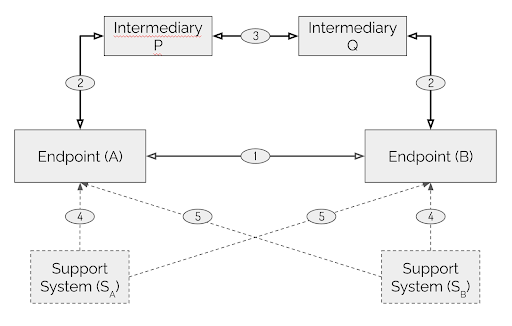

Trust Spanning Protocol (TSP) Specification
==================

**Specification Status**: vs1.0 Experimental Implementor's Draft

**Latest Draft:**

[https://github.com/trustoverip/tswg-tsp-specification](https://github.com/trustoverip/tswg-tsp-specification)

**Authors:**

- [Wenjing Chu](https://github.com/wenjingchu), [Futurewei Technologies, Inc.](https://futurewei.com)
- [Samuel Smith](https://github.com/SmithSamuelM), [ProSapien LLC](https://prosapien.com)

**Contributors:**

- The contributor list goes here

**Participate:**

~ [GitHub repo](https://github.com/trustoverip/tswg-tsp-specification)
~ [Commit history](https://github.com/trustoverip/tswg-tsp-specification/commits/main)

------------------------------------

[//]: # (Pandoc Formatting Macros)

[//]: # (\maketitle)

[//]: # (\newpage)

[//]: # (Pandoc Formatting Macros)

[//]: # (::: introtitle)

[//]: # (Introduction)

[//]: # (:::)

## Overview

The Trust Spanning Protocol (TSP) facilitates secure communication between endpoints with potentially different identifier types using message-based exchanges. As long as the endpoints use identifiers based on public key cryptography (PKC) with a verifiable trust root, TSP ensures their messages are authentic and if required, confidential. Moreover, it presents various privacy protection measures against metadata-based correlation exploits. These attributes of TSP allow endpoints to form authentic relationships rooted in their respective verifiable identifiers (VIDs), viewing TSP messages as virtual channels for trustworthy communication.

In recent years, a wide variety of decentralized identifiers have been proposed or are being standardized to meet a diverse set of use cases and requirements. This diversity underscores the critical need for a universal method to connect the systems these identifiers represent, akin to how the Internet Protocol (IP) connected various types of heterogeneous network designs during the initial phases of Internet development. Such a universal interconnection method must preserve the inherent trust embedded in the identifiers and facilitate the meaningful exchange of trust information between endpoints. This is essential for accurately assessing the suitability of the data these identifiers represent for the specific application contexts in which the parties may be engaged.

Note that although this specification primarily addresses decentralized identifier types, existing centralized or federated identifier types such as X.509 certificates can fulfill the VID requirements outlined in this specification. This is achievable within this specification by adopting a compliant format and enhancing the trust foundation of their corresponding support systems and governance processes.

Beyond offering enhanced trust properties when compared to previous solutions and focusing on the interoperability between differing types of VIDs, TSP is conceived as a universal protocol to serve as a foundation for various higher-layer protocols. This design approach draws inspiration from the success of the TCP/IP protocol suite. In the TSP context, directional TSP messages function as a unified primitive to bridge diverse endpoint types, similar to how IP packets enable inter-networking between distinct networks. Task level protocols or applications, intended to operate atop of TSP mirror the roles of TCP or UDP by providing task-specific solutions while harnessing the core properties of the TSP. In order to fulfill such a foundational role, TSP keeps its message primitives simple, efficient, and as much as possible eliminates unnecessary variants.

TSP messages can traverse various transport mechanisms without making prior assumptions about their trustworthiness although users may opt for specific underlying transport protocols for TSP based on various factors such as additional operational or security considerations. TSP messages can be transported directly between endpoints (Direct Mode) or routed via intermediaries (Routed Mode). We first describe the Direct Mode in [Section 3](#messages), followed by the routing mechanism in [Section 5](#routed-messages-through-intermediaries).

TSP stands as the spanning layer protocol within the Trust over IP technology architecture [spec-in[form:TOIP-TAS]]. It occupies a pivotal role, facilitating the twin goals of robust trustworthiness and universal interoperability across the Trust over IP stack. For additional details on the reference architecture, please see [Section 1.2](#reference-architecture).

### Terminology

The key words "MUST", "MUST NOT", "REQUIRED", "SHALL", "SHALL NOT", "SHOULD", "SHOULD NOT", "RECOMMENDED", "NOT RECOMMENDED", "MAY", and "OPTIONAL" in this document are to be interpreted as described in BCP 14 [[spec-norm:RFC2119]] [[spec-norm:RFC8174]] when, and only when, they appear in all capitals, as shown here.

[[def: Verifiable Identifier, Verifiable Identifiers, VID, VIDs]]
~ A Veifiable Identifier is a category of digital identifier that meets the requirements set forth in [Section 2](#verifiable-identifiers) of the Trust Spanning Protocol Specification. The requirements include cryptographic verification and assessment of governance as well as the associated [[ref: Support Systems]]. It does not itself define a digital identifier scheme. It is not restricted to a particular type of identifier class such as, centralized, federated, or decentralized identifier trust-based ecosystems.

[[def: TSP Relationship, Relationship, Relationships]]
~ A TSP relationship is a pairing of two [[ref: VIDs]] `<VID_a, VID_b>` where `VID_a` is a VID of the local [[ref: TSP Endpoint]] `A`, `VID_b` is a VID of the remote endpoint `B` where the local endpoint `A` has verified `VID_b` for use in TSP with its `VID_a`. Each [[ref: TSP endpoint]] maintains a [[ref:Relationship Table]] that contains such pairings for all active relationships. This pairing is directional by default, but if the verification has been made mutually in both directions it is referred to as a [[ref: Bi-directional Relationship]].

[[def: Bi-directional Relationship, Bi-directional Relationships]]
~ A [[ref: TSP Relationship]] is directional by default, but if the verification has been made mutually in both directions, it is referred to as a Bi-directional Relationship and is represented as `(VID_a, VID_b)` in the [[ref: Endpoint]] `A`'s [[ref: relationship table]] and `(VID_b, VID_a)` in endpoint `B`'s relationship table. A Bi-directional Relationship means that each endpoint has verified the other's VID indepedently.

[[def: Relationship Table, Relationship Tables]]
~ A table of [[ref: Relationships]] of a [[ref: TSP Endpoint]]. Each entry of the table is a [[ref: Relationship]] where a [[ref: VID]] of the endpoint is one of two VIDs in the pairing. 

[[def: TSP Endpoint, Endpoints, Endpoint]]
~ A TSP Endpoint is a secure computational system that runs the Trust Spanning Protocol. An Endpoint is able to obtain or create certain types of [[ref: Verifiable Identifiers]] possibly through the respective [[ref: Support Systems]], and is able to verify and assess another endpoint's VIDs via their corresponding [[ref: Support Systems]].

[[def: TSP Support System, Support System, Support Systems]]
~ A TSP Support System is a computational system that supports the management of [[ref: VIDs]] and in particular, facilitates assessment and verification of VIDs of an [[ref: Endpoint]]. 

[[def: TSP Intermediary System, Intermediary System, Intermediary, Intermediaries]]
~ A TSP Intermediary System or just "intermediary", is a computational system that assists [[ref: Endpoints]] in forwarding [[ref: TSP Messages]].

[[def: TSP Message, TSP Messages, Messages]]
~ A TSP Message is a single asynchronous message in TSP with assured authenticity and optionally, confidentiality and metadata privacy.

### Reference Architecture


Figure 1: TSP Reference Architecture

The Trust Spanning Protocol is defined within the Reference Architecture (RA) illustrated in Figure 1. The principal components of this reference architecture are:

- Direct Communication: Endpoints communicate with each other using TSP in direct mode, depicted by an arrowed line labeled number `1`. This communication pattern encompasses two directional relationships, with each endpoint evaluating the other independently.

- Routed Communication: Endpoints communicate using TSP in routed mode through [[ref: Intermediaries]], represented by arrowed lines labeled numbers `2` and `3`. It's important to note that intermediaries are not necessarily trustworthy.

- Identifier Management: Endpoints manage their [[ref: verifiable identifiers]] (VIDs) and associated roots of trust information via an abstract interface with their [[ref: Support Systems]], shown by dotted lines labeled number `4`. Additionally, endpoints verify and assess the counterpart in a [[ref: TSP relationship]] through another abstract interface with their respective support systems, denoted by dotted lines labeled number `5`.

### Authenticity, Confidentiality, and Metadata Privacy

In TSP, these properties are defined within the context of a directional [[ref: relationship]] formed by a pair of [[ref: verifiable identifiers]] between a source and a destination [[ref: endpoint]]. In this context, the source is also referred to as the *sender* and the destination as the *receiver* of a message. Authenticity is ascertained by the receiver, providing confidence that the received message remains unaltered and that the message genuinely originates from the sender. Confidentiality ensures that only the sender and receiver have access to the protected confidential payload data content. However, some parts of the message's envelope, not shielded by confidentiality protection, can be observed and used to infringe upon privacy through traffic analysis, correlation or other exploitative means. TSP provides optional mechanisms to safeguard against these vulnerabilities. This specific type of protection is termed *metadata privacy*, differentiating it from the narrower understanding of privacy, which concerns the prevention of content exposure to unauthorized parties, synonymous with confidentiality.

TSP messages always assure authenticity, optionally confidentiality, and if utilized, metadata privacy. The authenticity and confidentiality goals are achieved by a scheme combining public key authenticated encryption (PKAE) and a signature. The metadata privacy protections are achieved by nested TSP messages and routed messages through intermediaries.

### Use of Formats

TSP specifies message types that will have varying formats or representations during their lifecycle, both within systems that process or store them and networks that transport them. Additionally, for purposes such as debugging, documentation, or logging, these messages may need to be represented in a text format that is more accessible for human interpretation or better accepted for legal and administrative treatments.

TSP uses [[ref:CESR]] encoding for the envelope, payload structure and signature parts of TSP messages. CESR encoding allows composibility for complex cryptographic objects and easy convertions between text and binary representations while maintaining alignments of data objects. Within TSP's payload, other types of encoding may also be used in a mixed mode. 

We introduce the notation `“{a, b, c}”` as a concatenation of CESR encoded objects. It is also denoted as `CONCAT` in pseudo code. This does not mean that the data objects have to or are always represented in a concatenated form, but because CESR encoding is self-framed and composible, the actual concatenation can be performed when needed. With that caution, we will follow this method throughout this specification.

We also utilize text format for clarity and illustrative purposes within this specification. However, it should be understood that such text-based descriptions are solely to illustrate how the messages are structured. Implmentors should be aware of other formats in which cryptographic primitives are operated on or the various ways the message can be encoded for transport. For more details on serialization and encoding, please refer to [Section 9](#serialization-and-encoding).

## Verifiable Identifiers

The Trust Spanning Protocol does not mandate that [[ref: endpoints]] utilize only a single type of identifiers and this specification does not define one. However, the efficacy of TSP and the trust assurances in authenticity, confidentiality, and metadata privacy it provides hinge on the methodologies of VIDs. Factors such as the construction and resolution of these identifiers, coupled with the verification of trust information from their support systems, directly influence the degree of trust endpoints can derive from using TSP. In this section, we outline high-level requirements without prescribing how various VID types should fulfill them. All identifiers that meet these standards are termed [[ref: Verifiable Identifiers]] (VID). The aim is to enable endpoints, equipped with their chosen VID type or types, to communicate over TSP with the respective confidence and trust level that those VIDs inherently support.

A foundational prerequisite for TSP is that endpoints operate within a secure computing environment, possibly facilitated by tools such as Trusted Execution Environments (TEEs),  digital wallets, or digital vaults. This list of tools may extend to non-technical ones such as governance conventions or regulations. While TSP aids in transmitting trust signals between endpoints, it cannot instantiate trust where none exists.

In TSP, pairs of TSP endpoints establish directional [[ref: relationships]]. In these relationships, endpoints assess each other's identifiers independently. The verification and appraisal of VIDs remain inherently directional.

### VID Use Scenarios

In the Trust Spanning Protocol, VIDs function as identifiers within protocol envelopes and other control fields (see [Section 3](#messages)). As identifiers in exposed envelopes, VIDs may be visible to third parties with access to the network transports, allowing for potential correlation with other identifying transport mechanism information, such as IP addresses, transport protocol header information, and other metadata like packet size, timing, and approximate location. To mitigate the risk of metadata exploitation, TSP provides Nested Messages ([Section 4](#nested-messages)) and Routed Messages ([Section 5](#routed-messages-through-intermediaries)) for certain metadata privacy protections. Given the varied roles VIDs play in different scenarios, their management requires careful considerations. To clarify and simplify the discussion of these scenarios, we categorize VID uses into three scenarios: public, well-known, and nested.

We refer to the scenarios where VIDs are exposed to external entities as their *public* use. The address resolution operations of public VIDs may provide visible information to an adversary.

It's important to note that while additional security measures like TLS or HTTPS can be employed at the transport layer to safeguard VIDs, TSP does not inherently depend on these mechanisms for protection. Consequently, within the context of TSP, even VIDs protected by such transport layer security are treated as if they are '*public*,' assuming they could potentially be accessed or observed by external parties.

Within the category of public VIDs, there is a subclass known as *well-known* VIDs. These are VIDs whose controllers deliberately intend for them to be broadly recognized. The rationale behind making a VID well-known often revolves around streamlining or simplifying the processes of VID discovery, resolution, and verification. However, it's important to recognize that such actions inherently expose additional information to potential adversaries. As a subclass of public VIDs, well-known VIDs must also meet all public VID requirements.

VIDs are considered to be in *nested* use when their usage is protected within another instance of TSP relationship in a nested mode (See [Section 4](#nested-messages)). Nested VIDs are also called *inner VIDs* which bypass the need for address resolution. Their establishment operations are managed by TSP control messages, and all relevant operations are protected by the outer layer of TSP. For detailed descriptions of the nested mode of TSP, please refer to [Section 4](#nested-messages). The specifics regarding control messages are detailed in [Section 7](#control-payload-fields).

### VID General Requirements
This section specifies general expections TSP requires VIDs to meet. TSP uses VID as an abstract data type that must support a set of abstract operations. This section also lists these operations in a format like `VID.OPERATION`.

#### Cryptographic Non-Correlation

An endpoint can control multiple VIDs simultaneously and over extended periods. It is imperative that these VIDs are cryptographically non-correlatable in an information-theoretic security context, meaning the knowledge of one VID does not reveal any information about another.

For example, if an adversary observes VIDs `VID_a0` of endpoint `A` and `VID_b0` of endpoint `B` in a relationship `(VID_a0, VID_b0)`, where `VID_a0` is categorized as public and could be linked to a specific endpoint using additional metadata. However, if the same adversary also happens to observe `VID_a1`, it should be impossible by the identifiers alone for the adversary to establish a correlation between `VID_a1` and `VID_a0`, and consequently, to associate `VID_a1` with endpoint `A`.

#### VID Type

Each VID type MUST have a unique type code allocated for its exclusive use. The type code is out of an integer number space of 3 Base64 characters.

#### VID Syntax

TSP tries not to impose any additional syntax requirements beyond any VID type already mandates. But since TSP uses CESR for VID encoding, any VID's syntax MUST have at least one compliant CESR encoding, including VID Type.

#### Resolution to Transport Address

For every VID to be in public use, the VID MUST support an address resolution operation `VID.RESOLVEADDRESS` for each transport mechanism that the VID supports. 

Implementation of this address resolution operation is VID type specific.

For any VID that is used in nested mode only, an address resolution mechanism is unnecessary.

#### Mapping VID to Keys
VIDs MUST support operations by the controlling endpoint to map a VID of its own to keys required by TSP.
- Mapping to public and private keys used by PKAE: `VID.PK_e` and `VID.SK_e`.
- Mapping to private key or keys used by signature signing: `VID.SK_s` or `VID.SK_s_i`, i = 1..K.

VIDs MUST support operations by an assessing endpoint to map a VID of another endpoint to keys required by TSP.
- Mapping to the public key used by VID verification: `VID.PK_s`.
- Mapping to the public key used by PKAE: `VID.PK_e`.
- Mapping to the public key used by signature verification: `VID.PK_s`.

Implementation of these mapping operations is VID type specific.

#### Verification
VIDs MUST support an operation by an assessing endpoint to verify a VID of another endpoint: 
- `VID.VERIFY` for TSP to verify that endpoint `A` has access to the corresponding secret key, `VID.SK_s`, using a PKC algorithm. VID types MAY use additional information in assessing the VID in the same `VID.VERIFY` operation.

Implementation of this mapping and verification operations is VID type specific.

For any VID designated for nested use, while the same verification procedure requirements as outlined above still apply, simpler VID types MAY be employed. This is because the verification process occurs between two endpoints that already possess a verified TSP relationship between them, and the verification is conducted through TSP messages within that established relationship. TSP defines specific message types for such instances of nested VID verification in [Section 7](#control-payload-fields).

#### Handling Changes

::: issue #4
TODO
https://github.com/trustoverip/tswg-tsp-specification/issues/4
:::

### Examples

::: issue #5
This section should include a list of example [[ref: Verifiable Identifiers]]. The list may include: KERI AID, `did:webs`, `did:x509`, `did:peer` for private use, and one or two examples based on a public blockchain. For each example, information discussions can provide recommendations on how the required primitives may be implemented.
https://github.com/trustoverip/tswg-tsp-specification/issues/5
:::

- KERI AID


- `did:webs`


- `did:x509`


- `did:peer` for private use


## Messages

TSP operates as a message-based communication protocol. The messages in TSP are asynchronous, can vary in length, and are inherently directional. Each message has a designated sender (alternatively termed "source") and a receiver (or "destination"). Throughout this specification, in particular when we describe the routed mode in [Section 5](#routed-messages-through-intermediaries), the terms "sender" and "receiver" will be used to refer to direct neighbors, while the terms "source" and "destination" will be used for the originating and ending endpoints of the carried message. Within the context of TSP, both the sender and the receiver of a message qualify as "endpoints." Entities such as Intermediaries or Support Systems can also function as endpoints when they are participating in TSP communications themselves. For the sake of simplicity, we will uniformly refer to all these entities as "endpoints," unless a distinction is necessary for clarity.

In this section, we specify TSP messages that are used in Direct Mode between neighboring endpoints without any intermediaries in between. By being *direct*, we mean that there is a direct transport layler link between the two endpoints in the TSP layer. In comparision, Routed Mode, specified in [Section 5](#routed-messages-through-intermediaries), involves at least one intermediary or more in the TSP layer.

As outlined in [Section 2](#verifiable-identifiers), VIDs serve as identifiers for any endpoints involved in TSP. Both the sender's VID and the receiver's VID can map to required keys used by TSP in the sender and the receiver, and to a transport address for delivering the TSP message.  The sender and receiver VIDs can be of different VID types.

TSP messages are made of three parts: envelope, payload and signature, as illustrated in the pseudo-formula below.

```text
TSP_Message = {TSP_Envelope, TSP_Payload, TSP_Signature}
```

We now define these parts in the following sections.

### TSP Envelope

The TSP envelope part of a TSP message contains: TSP Version, Sender VID, Receiver VID.

```text
TSP_Envelope = {TSP_Tag, TSP_Version, VID_sndr, VID_rcvr | NULL}
```

- TSP_Tag: A unique code that unambigously flags the start of a TSP envelope.
- TSP_Version: The version of Trust Spanning Protocol with 3 Base64 characters.

VIDs in TSP are encoded with a VID_Type and a VID_String. If the VID type has variable length, then the VID string consists of length followed by a bytestring of that length.

- VID_Type: An assigned code number specific to each VID type that is from a number space of 3 Base64 characters. Please see Section [VID Type](#vid-type) for further information about VID types. 

- VID_String: Its format is determined by each VID type. 

`VID_sndr` and `VID_rcvr` (if present) may have different VID types.

### TSP Payload

The TSP payload is where application's data goes. It is divided into two parts: Non-Confidential Fields and Confidential Fields. The confidential fields are encrypted and appear in the payload as ciphertext. It is up to the upper layer to choose where their data will go. 

```text
TSP_Payload = {Non_Confidential_Fields, Confidential_Fields_Ciphertext}
```

#### Non-Confidential Fields

The non-confidential fields are optional, and if present, not encrypted. They may contain header and data fields.

The non-confidential header fields may contain data Type and Subtype codes, and other fields for control use. The non-confidential data fields can be any data fields encoded in CESR, including mixed JSON, CBOR and MsgPack encoded data as supported by CESR.

#### Confidential Fields

The confidential fields of the payload are encrypted through PKAE. What is encoded in the message is the ciphertext of the corresponding plaintext which may contain both header and data fields in the same way as the non-confidential fields.

And the ciphertext is produced as:

```text
Confidential_Fields_Ciphertext = TSP_SEAL({Confidential_Fields_Plaintext})
```

The details of the supported PKAE schemes for the `TSP_SEAL` operation are specified in Section [Cryptographic Algorithms](#cryptographic-algorithms).

The confidential header fields may contain an optional list of VIDs, the payload data Type and Subtype codes, and other control fields. We will define these fields when we define individual payload fields for specific messages.

For PKAE schemes *HPKE-Base* [ref:RFC9180] and *Libsodium sealed box* [ref:TOADD], the `VID_sndr` MUST appear in the confidential heade fields following the ESSR scheme from [2]. See [Section 8](#cryptographic-algorithms) for the details.

The header fields also contain a list of intermediary hop VIDs for Routed Mode messages. See [Section 5](#routed-messages-through-intermediaries) for the detailed description.

The confidential payload data field can be any data encoded in CESR, including mixed JSON, CBOR and MsgPack encoded data as supported by CESR. Since TSP message itself is encoded in CESR, it can be embedded in the data field, resulting a [[ref:Nested Message]].

On the receiving side, the corresponding TSP primitive is `TSP_OPEN`.

#### Header Fields

As described above, healder fields may appear in non-confidential or confidential fields. They have the same format and meaning regardless of whether they are encrypted. However, certain header fields are required to be in confidential fields if confidentiality is desired by the application.

- *Type* and *Subtype*

The `Type` is an allocated code indicating quickly what the payload is intended for. For example, an upper layer application may use type code similar to TCP or UDP port numbers.

The type code `TSP_CTL` is reserved and special. It indicates that the payload data fields that followed are for the control operations of TSP and should be passed on to the TSP rather than an application. When control data is present, a TSP message MAY optionally contain normal application data as well. The control data SHOULD come before the user data when both are in the same payload.

The type code `TSP_GEN` is reserved. It is used by applications where this code is not needed or doesn't care.

For each `Type`, a space of `Subtype` is available for use by the application designated by the `Type`. The use of subtype is optional.

For `TSP_CTL`, we will introduce `Subtype` codes in Section [Control Payloads](#control-payloads).

- *Thread_ID*

The `Thread_ID` field is generated using TSP_DIGEST over the binary representation of the received message

- *Nonce*

Some TSP message may have deterministic content and is vunerable to message replay attack. For these messages, a Nonce field is added to the header.

::: issue #6
Discuss if a timestampe is useful.
https://github.com/trustoverip/tswg-tsp-specification/issues/6
:::


### TSP Signature

The third part of a TSP message is the signature signed by the sender.

```text
TSP_Signature = TSP_SIGN({TSP_Envelope, TSP_Payload})
```

On the receiving side, the corresponding primitive is `TSP_SIG_VERIFY`. The details of the `TSP_SIGN` and `TSP_SIG_VERIFY` are specified in Section [Cryptographic Algorithms](#cryptographic-algorithms).

### TSP Message Examples

Applications can use TSP messages, as defined above, in any way they want. In this section, we discuss two common scenarios that may be particularly useful. In the first case, all user data is in the confidential data fields and TSP assures both authenticity and condientiality. In the second case, all user data is in the non-confidential data fields.

#### Authentic and Confidential (AAC) Messages

```text
Authentic_Confidential_Message  = {TSP_Envelope, Confidential_Payload_Ciphertext, TSP_Signature}
                                = {TSP_Tag, TSP_Version, VID_sndr, VID_rcvr, 
                                    Confidential_Payload_Ciphertext, TSP_Signature},
where,

Confidential_Payload_Ciphertext = TSP_SEAL ({Confidential_Payload_Header, 
                                                Confidential_Payload_Data}),

and

TSP_Signature = TSP_SIGN({TSP_Envelope, Confidential_Payload_Ciphertext}).
```

These messages use the `VID_sndr` and `VID_rcvr` pair and has no non-confidential fields, i.e. all payload is encrypted.

#### Authentic Non-Confidential (ANC) Messages

```text
Authentic_Non_Confidential_Message  = {TSP_Envelope, Non_Confidential_Payload, TSP_Signature}
                                    = {TSP_Tag, TSP_Version, VID_sndr, 
                                        Non_Confidential_Payload, TSP_Signature},
where,

TSP_Signature = TSP_SIGN ({TSP_Envelope, Non_Confidential_Payload}).
```

These messages do not have `VID_rcvr` and the payload is entirely non-confidential. 

### Relationships

A [[ref: TSP relationship]] is a pairing `<VID_a, VID_b>` of two VIDs controlled by the respective endpoints `A` and `B` indicating that endpoint `A` has satisfactorily verified `VID_b` of endpoint `B`.

An endpoint is able to obtain (or create) one or more VIDs possibly through the service of their respective [[ref: Support Systems]]. Let us say `VID_a` is one of such VIDs for endpoint `A`. As a convention, we will use lower case letter, such as `a`, to indicate that `VID_a` is controlled by the endpoint named with the corresponding upper case letter, say `A`. Details of VID management for any VID type is out of scope for this specification but an endpoint will need to implement necessary supports for all of its supported VID types.

By [Out of Band Introduction](#out-of-band-introductions) or other TSP [relationship formation messages](#control-payloads), endpoint `A` learns a `VID_b` of endpoint `B`. At this point, endpoint `A` chooses `VID_a` and performs necessary verification and appraisal operation on `VID_b` with respect to `VID_a`. If the verification is successful, endpoint `A` may add a relationship `<VID_a, VID_b>` to its relationship table.

At this point, endpoint `A` may resolve `VID_b` to obtain transport layer address for delivery of a TSP message with `VID_a` as the sender VID and `VID_b` as the receiver VID.

When endpoint `B` receives this TSP message, if this is the first TSP message from `VID_a` to `VID_b` and endpoint `B` had not verified `VID_a` before, endpoint `B` will perform necessary verification and assessment to evaluate `VID_a` with respective to `VID_b`. If successful, endpoint `B` may also add relationship `<VID_b, VID_a>` to its relationship table.

In short, one successful TSP message exchange between two endpoints populates one relationship on each endpoint's relationship table. The relationships in their respective tables are the mirror image of each other in the form of `<VID_local, VID_remote>`. We may interprete this relationship as the state that the endpoint has verified `VID_remote` with respect to `VID_local`, or the pair of the VIDs are in a *verified* state. Note that because of the asynchronous nature of TSP messages, such state is also not always synchronized between the two endpoints. Their relationship table is not guaranteed to be always accurate.

Since endpoints may reuse VIDs, an endpoint may have relationships `<VID_a, VID_b>` and `<VID_a, VID_c>` in its relationship table at the same time. Only a pair together uniquely identifies a relationship.

Endpoints may have semantic meaning or application specific allocations associated with VIDs. For this reason, we say an endpoint `A` verifies and assesses a `VID_b` with *respect to* a local `VID_a`. The evaluation process may have dependecy on the chosen `VID_a`.

After endpoint `B` processed the first TSP message from `VID_a` to `VID_b` and accepted a new relationship `<VID_b, VID_a>`, it may decide to reply with its own TSP message in the opposite direction. It is common, although neither required nor always needed, that the two endpoints want to engage in bi-directional communications. At this point, endpoint `B` can update the corresponding relationship into a [[ref: bi-directional relationship]] `(VID_b, VID_a)`. Upon successfully receive the return TSP message by endpoint `A`, it can also update its relationship to bi-directional: `(VID_a, VID_b)`.

::: note
The notation `<VID_local, VID_remote>` is used for representing a uni-directional relationship, and `(VID_local, VID_remote)` for a bi-directional relationship.
:::

For details of relationship forming TSP control messages, please refer to [Section 7](#control-payload-fields). The following Sections [3.7](#sender-procedures) and [3.8](#receiver-procedures) describes in more detail the operations required for sending and receiving TSP messages.

### Sender Procedure

We outline the procedures for TSP message senders for the simple Direct Mode case in two parts: the initial message which establishes the relationship, and the follow-up messages that occur within that established relationship.

Endpoint `A`, which controls `VID_a` associated with Support System `A*`, acquires `VID_b` of Endpoint `B` through an [out-of-band introduction (OOBI)](#out-of-band-introductions) method, or a TSP [relationship forming message](#control-payload-fields) of another existing relationship. `VID_b` is tied to Support System `B*`. Note that `A*` could be the same as or different from `B*`. If Endpoint `A` selects to employ `VID_a` to dispatch a TSP message to the Endpoint identified by `VID_b` for the first time, it will be establishing a unidirectional relationship denoted by `<VID_a, VID_b>`.

The following is an example procedure that Endpoint `A` may follow when sending its inaugural message to `VID_b` using its own `VID_a`. This example is only illustrative. Implementors will need to pay considerations to the actual VID type's and the chosen transport mechanism's requirements, and the requirements of applications they intend to support.

- Step 1: Resolve `VID_b` to acquire access to the following mandatory information
    - Public keys bound to the VID for TSP: `VID_b.PK_e`, `VID_b.PK_s`
    - All other VID verification information as required by the VID type ([Section 2](#verifiable-identifiers))
    - Transport information, if it is not yet known.
- Step 2: Verify `VID_b` with `VID_b.VERIFY`.
- Step 3: Create a TSP message
    - As the first TSP message, it MUST contain the relationship forming payload fields.
    - It may optionally also contain other user data. In other words, applications do not have to wait for a round trip delay for relationship establishment.
- Step 4: Use the retrieved transport information in Step 1 to establish a means of transport, if not yet available. Note that this step will be significantly different depending on the details of the transport of choice. [Section 10](#transports) discusses additional transport considerations.
- Step 5: Send the TSP message.
- Step 5: Update relationship table with `<VID_a, VID_b>`.

For subsequent messages, the procedure is simpler:

- Step 1: Create a TSP message
- Step 2: If the retrieved transport mechanism is ready to use (e.g. if it's cached or kept hot), send the message. If not, refresh operations will be needed first.

In the above much simplified example, we have not considered any dynamic changes or error conditions.

### Receiver Procedure

Similar to the previous section, the following example is only illustraitve for the receiver of a simple Direct Mode TSP message.

If endpoint `B` receives a TSP message of the generic form `{... VID_sndr, VID_rcvr, ... Confidential_Payload_Ciphertext, TSP_Signature}`, endpoint `B` may follow these steps to process this incoming message:

- Step 1: Check if the `VID_sndr` and `VID_rcvr` pair matches an existing valid relationship in its relationship table. If yes, jump to Step 5; otherwise this is the first message of this relationship.
- Step 2: Check if `VID_rcvr` is a valid local VID and local rules permit to proceed.
- Step 3: Resolve `VID_sndr` to acquire access to the following mandatory information
    - Public keys bound to the VID for a TSP crypto suite
    - All other VID verification information as required by the VID type ([Section 2](#verifiable-identifiers))
    - Transport information, if it is not yet known.
- Step 4: Verify, and appraise `VID_sndr` using additional information and processes specific to the VID.
- Step 5: Verify the `TSP_Signature`.
- Step 6: Decrypt the `Confidential_Payload_Ciphertext`. 
- Step 7: If the PKAE variant requires, retrieve the sender VID from the decrypted payload plaintext and verify that it matches `VID_sndr`.
- Step 8: Process the rest of control fields.
- Step 9: Return the payload to the upper layer application.

### Out of Band Introductions

Before an endpoint `A` can send the first TSP message to another endpoint `B`, it must somehow discover at least one VID that belongs to `B`. If they also wish to utilize the Routed Mode, as specified in [Section 5](#routed-messages-through-intermediaries), then additional VIDs may also be needed before the first TSP routed message can be sent. We call any such method that could help the endpoints discover such prerequisite information an Out of Band Introduction (OOBI). There may be many such OOBI methods. Detailed specifications of OOBI methods are out of scope.

For the purpose of TSP, information obtained from OOBI methods must not be assumed authentic, confidential or private, although mechanisms to remedy such vulnerabilities should be adopted whenever possible. TSP implementations must handle all cases where the OOBI information is not what it appears.

Because TSP relationships can be highly authentic, confidential and potentially more private with respect to metadata, they can be used for the purpose of passing VID information for forming new relationships. Details of such procedures used for introductions are specified in Section [Control Payloads](#control-payload-fields).

## Nested Messages
When TSP sender `A` dispatches a TSP Message with confidential payload intended for receiver `B`, the observable data structure for any third party not involved in the message exchange between `A` and `B` appears as:

```text
{TSP_Tag, TSP_Version, VID_a, VID_b, TSP_Payload_Ciphertext, TSP_Signature}
```

Over time, with a sustained exchange of such messages, an external observer may accumulate a significant volume of data. This data, once analyzed, could reveal patterns related to time, frequency, and size of the messages. Using `VID_a` and `VID_b` as keys, an observer can index this dataset. It's then possible to correlate this indexed data with other available metadata, potentially revealing more insights into the communication.

To mitigate this threat, TSP offers a technique whereby parties encapsulate a specific conversation — for instance, a sequence of messages — within an additional TSP envelope, as described below.

### Payload Nesting
Suppose endpoints `A` and `B` have established a prior direct relationship `(VID_a0, VID_b0>)`, they can then embed the messages of a new relationship `(VID_a1, VID_b1)`  in the confidential payload of `(VID_a0, VID_b0)` messages. In such a setup, `VID_a1` and `VID_b1` are protected from third party snooping. We may refer `(VID_a0, VID_b0)` the *outer relatioship* and the messages of `(VID_a0, VID_b0)` as *outer messages*, and `(VID_a1, VID_b1)` the *inner relationship* and the messages of `(VID_a1, VID_b1)` as *inner messages*.

The above description also applies to uni-directional relationships.

This nesting scheme can be illustrated as follows using the confidential data field of its payload.

```text
Outer_Message = {Envelope_0, Payload_0, Signature_0},
Inner_Message = {Envelope_1, Payload_1, Signature_1}, 
Nested_Message = {Envelope_0, {Non_Confidential_Fields_0,
                                TSP_SEAL_0({Header_Fields_0, Inner_Message})}, Signature0}
```

In this scheme, the inner message MUST use the confidential data field of the outer message in order to achieve the protection of the inner message metadata. Other than that, we do not restrict the structures of inner and outer messages. For example, if the endpoints do not find the need for additional encryption of the inner message, they MAY choose to use the non-confidential payload fields for the inner message payload data. Applicatios should be aware that the confidentiality assurances would only be extended to the outer relationship if the inner message is embedded in the non-confidential field of the outer message.

### Nested Relationships

When TSP messages utilize this nesting approach, a new relationship, for example `(VID_a1, VID_b1)`, is created between the same endpoints `A` and `B`. This new type of relationships may be used for providing *context* over the aggregate of all messages between the same pair of endpoints. The privacy protection afforded by this method is designated as one example of *metadata privacy.* Since the nested messages hide the inner VID pair from being collected as a part of potential correlation attacks, we also refer to this style of privacy protection as *correlation privacy.*

The process for establishing such relationships with nested messages is detailed in [Section 7](#control-payload-fields). It's important to note that this nesting can be recursively applied, adding additional layers as required. Inner relationships are situated within an outer relationship that has been verified and deemed suitable for the intended purpose by both participating endpoints. The VIDs engaged in these inner relationships may therefore be considered as *private*, do not require same level of verification as *public* VIDs, and do not require transport layer address resolution of their own.

### A Shorthand Notation
For brevity and ease of presentation, we introduct a shorthand notation for nested messages, and indirectly the relationship in which these messages are communicated, as follows.

``` text
[VID_sndr, VID_rcvr, Payload] = {TSP_Tag, TSP_Version, VID_sndr, VID_rcvr, Payload, Signature}
```
This is only a simplication in notation. All message fields remain the same as defined in the previous sections, including the generation of ciphertext and signature fields.

``` text
[VID_sndr_out, VID_rcvr_out, [VID_sndr_in, VID_rcvr_in, Payload_in]] = {
    Envelope_out, {Non_Confidential_Fields_out, TSP_SEAL_out(Header_Fields_out, Inner_Message)},
    Signature_out }

where,
Inner_Message = [VID_sndr_in, VID_rcvr_in, Payload_in, Signature_in]
```

Such a notation does not imply any extra requirements or restrictions for the messages. 

For example, we may use the following shorter notation to represent the example nested message shown above:

`[VID_a0, VID_b0, [VID_a1, VID_b1, Payload]]`

## Routed Messages Through Intermediaries

Intermediaries are systems utilized by endpoints to enhance various aspects of TSP communication, such as asynchronous delivery, reliability, performance, among others. In this specification, our primary focus is on their role in ensuring metadata privacy protection for communications between endpoints.

### Metadata Privacy in Routed Mode

Metadata privacy is one of the primary goals of deploying TSP in the routed mode. The TSP endpoints, the sender and receiver, aim to route their messages through chosen intermediaries, maintain the same authenticity and confidentiality properties of TSP and enhance the protection of metadata privacy related to the following exposures:

- The exposed direct neighbor relationship VIDs and related network transport information used to carry TSP messages are publicly knowable by all third parties. The TSP routed mode shields exposure of VIDs in endpoint-to-endpoint relationships through nested envelopes as defined in [Section 4](#nested-messages).
- VIDs used in routing and part of route information are knowable by the intermediaries along the routing path by necessity. The intermediaries are given only limited trust related to carrying out routing functions. Another layer of nesting allows endpoints to shield their inner contextual relationship VIDs from the intermediaries in the routing path.

In the high level, an overall endpoint-to-endpoint TSP routed mode involves three types of relationships.

- Direct neighbor relationships
    - Sender and its intermediary relationship
    - Intermediary to intermediary relationship
    - Receiver and its intermediary relationship
- Endpoint-to-endpoint relationship
- Nested private endpoint-to-endpoint relationship

The overall TSP routing is accomplished with a combination of designating intermediaries in the routing path and unwrapping nested messages and routing via direct neighbor relationship. The neighbors may create a routing context specific relationship for the purpose of routing en route messages.  A typical three hop pattern of TSP routed message may traverse from source endpoint `A` to its intermediary `P`, then from `P` to another intermediary `Q`, and from `Q` to the destination `B`. Naturally, the number of intermediaries in the route path may not be limited to 2. We may generalize such a route path as `VID_hop1, VID_hop2, ..., VID_hopk, VID_exit`, where:
- `VID_hop1` is the VID of the first intermediary that is in direct relationship with the source.
- `VID_hop2, ..., VID_hopk`: are VIDs of the intermediaries in the chosen route path. `VID_hopk` must be the last intermediary that is in direct relationship with the destination endpoint.
- `VID_exit`: This is the VID used by `hopk` intermediary for its direct relationship with the destination.

The exact nature of how the intermediaries exchange necessary information in order to perform the routing of TSP messages needs not be fixed or follows a pre-determined way. We describe some ways in which this may be accompalished but implementors are free to use other ways to achieve the same goal.

### Routed Messages

For routed messages, we need to distinguish the terms “sender” and “source”, and “receiver” and “destination". We reserve the terms “sender” and “receiver” for direct neighbors relationships between whom the message is being transported from one party to another (i.e. being routed). We reserve the terms “source” and “destination” for endpoint-to-endpoint relationships between whom the carried inner message is being communicated.

As we will see below, the source endpoint MAY choose the first hop of the route, then must acquire the remaining route path information `[VID_hop2, ..., VID_hopk, VID_exit]` before it can attempt to route a TSP message through a series of intermediary hops. This route path information MAY be acquired in part from an [Out-Of-Band Introduction](#out-of-band-introductions), or TSP control messages ([Section 7](#control-payload-fields)), or other means outside the scope of this specification.

For a common case of `k = 1 or 2`, the route hop list MAY be acquired in a simple arrangement:
- The source endpoint `A` has chosen an intermediary `P` and established a relationship `(VID_a1, VID_p1)`, then `VID_hop1` is `VID_p1`. This VID is used as the `VID_rcvr` in the envelope.
- The destination endpoint `B` has chosen an intermediary `Q` and established a relations `(VID_b1, VID_q1)`, then `VID_exit` is `VID_q1`. The intermediary `Q`, as a common service provider, may have published a well-known public `VID_q0`, then `VID_hop2` is `VID_q0`.
- The destination endpoint `B` MAY share the routing information `VID_q0, VID_b1` in the Out-Of-Band Introduction mechanism or control payload in another TSP relationship, together with its chosen `VID_destination`.
- The source endpoint `A` combines them together to form the whole message: `[VID_a1, VID_p1, VID_q0, VID_b1, Payload]`.
- If the intermediary chosen by `B` is also acceptable to `A`, and the parties accept a single intermediary (with its potential loss of some metadata protection), then the resulting route may simply be `[VID_sndr, VID_intermediary_rcvr, VID_exit, Payload]`.

TSP routed messages have the same TSP Envelope but extends the header fields of the payload with the following structure:

``` text
Payload_Header_Fields = {VID_sndr|NULL, VID_hop2, ..., VID_hopk, VID_exit}
```
The first VID in the heade fields `VID_sndr` is the VID required by ESSR PKAE schemes. If a PKAE scheme does not require this field, for example `HPKE_Auth`, then this MAY be empty.

The VIDs following the first `VID_sndr` is an ordered list of next hop VIDs of intermediaries and the last VID of the destination endpoint. The list can vary in length from 1, 2, to k > 2, and should be interpreted as in the order of a routing path with the `VID_hop2` coming first. Note that the first hop is already identified as the `VID_rcvr`.

In our shorthand notation, we also include the destination’s intermediary VIDs. 

``` text
[VID_sndr, VID_rcvr, VID_hop2, ..., VID_hopk,, VID_exit, Payload] 
```

The VID hop list MUST be in the payload header fields.

Each intermediary processes the received TSP message `{VID_sndr, VID_rcvr, Payload}` normally and after `TSP_OPEN` it MUST process the payload header information to see if routing hops are present. If they are, the intermediary MAY consult other administrative or operational conditions then decide to forward the message payload to the next hop identified by the first VID in the list. The forwarded message will use that VID as `VID_rcvr` and remove it from the list before forwarding.

If the confidential payload fields are chosen for the routing fields, then for any third party, this message appears as a normal TSP message in the form of `{VID_sndr, VID_rcvr, Ciphertext, Signature}`.

### Direct Neighbor Relationship and Routing

Endpoint `A` chooses an intermediary, denoted as `P`, and forms a bidirectional neighbor relationship. In Figure 6, the neighbor relationship between `A` and `P` is illustrated as: `(VID_a1, VID_p1)`, which is assumed to be established before message routing takes place. This assumption also applies to neighbor relationships between intermediaries `P` and `Q`, and between endpoint `B` and its intermediary `Q`, as shown in Figure 6. Message routing between endpoint `A` and endpoint `B` takes place within this established network of relationships.

Figure 6: Direct neighbor relationships

These direct neighbor relationships allow normal TSP messages listed below:

- `[VID_a1, VID_p1, Payload]`
- `[VID_p0, VID_q0, Payload]`
- `[VID_q1, VID_b1, Payload]`

We will detail each party’s operations in the following sections.

#### The Source Endpoint
The source endpoint `A` send the following routed message to intermediary `P`:

``` text
[VID_a1, VID_p1, VID_q0, VID_q1, Payload]
```

Again, the VIDs (`VID_q0` and `VID_q1`) may become known to endpoint `A` prior to this step via an OOBI, a TSP control payload, or other discovery protocol that is out of scope. Note that in this outer layer, all VIDs shown are public while `p0` and `q0`, as public VIDs of intermediaries, may also be well-known.

#### The Source Endpoint's Intermediary

The source’s intermediary `P` MUST support routed messages. As previously specified, the intermediary MUST decrypt the payload, if it's confidential, and process its payload heade filed to retrieve the route VID(s). The next VID in the list, `VID_q0` in this case, is the next hop’s VID. `P` MUST attempt to route the carried message to the next hop.

If the `(VID_p0, VID_q0)` relationship is pre-existing, `P` knows how to forward the message. If it is not pre-existing but `VID_q0` is public, `P` can resolve it and establish a new `<VID_p0, VID_q0>` or `(VID_p0, VID_q0)` relationship using normal procedures specified in [Section 3](#messages). `P` then routes the message to `Q` using the following message:

``` text
[VID_p0, VID_q0, VID_q1, Payload]
```

Note that the new `VID_sndr` and `VID_rcvr`, and the shortened VID route list (`VID_q1` only).

#### The Destination Endpoint's Intermediary

The destination’s intermediary, `Q`, also decrypts, if it's confidential, the payload header fields to retrieve the remaining route VID list. The next VID in the list, `VID_q1`, is the next hop’s VID. `Q` must attempt to route the carried message to the next hop.

If `VID_q1` is given to endpoint `A` by `B` itself in either an Out-Of-Band Introduction or a TSP message control payload, the `<VID_q1, VID_b1>` or `(VID_q1, VID_b1)` relationship should be pre-existing, and `Q` knows how to forward the message. If that relationship is not found in its local relationship table, the intermediary `Q` should consider this as an error. Otherwise, `Q` forwards the message to endpoint `B` using the following direct message:

``` text
[VID_q1, VID_b1, Payload]
```

Note that this is a normal direct message as the route VID field is now empty.

#### The Destination Endpoint

When the destination receives the message it is now a normal direct mode message: `[VID_q1, VID_b1, Payload]`. Note that endpoints are not required to handle routed messages that contain additional next hop VID or VIDs.
Unlike direct mode messages, this message’s sender `VID_q1` is of the intermediary `Q`, but the source `A`; and its receiver `VID_b1` is associated with the relationship with `Q`, not `A`. It means that the destination endpoint `B` can not be assured of the message’s authenticity, confidentiality nor metadata privacy. To solve these problems, endpoints MUST use additional procedures specified in the following sections.

### Endpoint-to-Endpoint Messages

In [Section 5.3](#direct-neighbor-relationship-and-routing), we defined a routed operation method that enables a source endpoint to send a TSP message to a destination endpoint via a series of intermediaries, using a hop-by-hop approach. However, while this approach provides a way of message delivery from the source to the destination, it doesn't uphold the core trust properties TSP aims to provide — specifically, authenticity, confidentiality, and metadata privacy — with respect to third parties or intermediaries. In this section, we define endpoint-to-endpoint messages carried within the payload of routed messages and the corresponding endpoint-to-endpoint relationship which does ensure authenticity, confidentiality, and a degree of metadata privacy. This operation is illustrated in Figure 7 below.

Figure 7: Endpoint-to-Endpoint relationship between endpoints A and B through a routed path

#### The Source Endpoint

The source endpoint `A` will create an endpoint-to-endpoint relationship with endpoint `B` using the same procedure specified in [Section 3](#messages). Instead of direct messages in Section 3, the endpoint `A` will use routed messages defined in [Section 5.3](#direct-neighbor-relationship-and-routing). Recall in Section [5.3.1](#the-source-endpoint), endpoint `A` sends the following message to intermediary `P` en route to eventual destination `B`:
``` text
[VID_a1, VID_p1, VID_q0, VID_q1, Payload]
```
To create an endpoint-to-endpoint relationship between `A` and `B`, Endpoint `A` will encapsulate its [relationship forming message](#control-payloads) with endpoint `B` as follows:

``` text
[VID_a1, VID_p1, VID_q0, VID_q1, [VID_a2, VID_b2, Payload_e2e]]
```

Because this is the first layer where endpoint-to-endpoint communication takes place, the source MUST use its own encryption and signing and not opt out as described in [Section 4](#nested-messages).

#### The Destination Endpoint

As described in [Section 5.3](#direct-neighbor-relationship-and-routing), this message will be delivered to the destination `B` in the form of,
``` text
[VID_q1, VID_b1, Payload]
```
This message is routed transparently by the intermediaries (or a single intermediary). The destination endpoint `B` decrypts its confidential payload to retrieve the inner message with `Payload_e2e`:
``` text 
[VID_a2, VID_b2, Payload_e2e]
```

Note that the intermediaries (or intermediary) do have visibility to `VID_a2` and `VID_b2` but not `Payload_e2e` if it is embedded in the confidential payload fields.

Now the destination `B` has a Direct Mode message from the source with `VID_a2` and addressed to its own `VID_b2` and can perform the same procedure as specified in [Section 3](#messages) to ensure authenticity and confidentiality, and establish the corresponding relationship `<VID_a2, VID_b2>`. In terms of metadata privacy, `VID_a2` and `VID_b2` are not visible to third parties but are visible to intermediaries. 

To minimize potential risks of exposure, the intermediaries SHOULD not process the endpoint-to-endpoint VIDs `VID_a2` and `VID_b2` and MUST NOT store `VID_a2` and `VID_b2` in any persistent storage.

As described in [Section 4](#nested-messages), endpoints may use nested messages to further strengthen metadata privacy. This is also true for routed messages. In the next section, we specify such a nested method such that contextual VIDs between endpoints `A` and `B` can be hidden from the intermediaries as well.

### Nested and Private Endpoint-to-Endpoint Messages

In this section, we specify an operation using nested messages over the endpoint-to-endpoint messages described in the previous section. The purpose of this nested mode is to hide the private contextual VIDs from being visible by the intermediaries. Use of such a method is optional.

The nested private endpoint-to-endpoint pattern is illustrated in Figure 5.

#### The Source Endpoint
Using procedures defined in Sections [4](#nested-messages) and [5](#routed-messages-through-intermediaries), endpoints `A` and `B` choose `VID_a3` and `VID_b3` respectively for the private contextual relationships. The source `A` then sends its message to `B` using a message described in the previous section as follows:

``` text
[VID_a1, VID_p1, VID_q0, VID_q1, [VID_a2, VID_b2, Payload_e2e]]
```

The nested inner message is then embedded into the `Payload_e2e`:
``` text
[VID_a3, VID_b3, Payload_inner]
```

Since `Payload_e2e` is inside of the endpoint-to-endpoint confidential payload, `VID_a3` and `VID_b3` are not visible to intermediaries.

#### The Destination Endpoint
As described in [Section 5.4](#endpoint-to-endpoint-messages), the destination `B` receives:
``` text
[VID_q1, VID_b1, [VID_a2, VID_b2, Payload_e2e]]
where,
Payload_e2e = [VID_a3, VID_b3, Payload_inner]
```

`B` then decrypts `Payload_e2e` as needed, and then verifies and forms another relationship `<VID_a3, VID_b3>` and receives the payload `Payload_inner`.

### Routing with a Single Intermediary

The endpoints `A` and `B` may use the same intermediary, i.e, `P` = `Q`. Since `A` and `B` usually choose their intermediaries independently, this scenario may happen by coincidence. Regardless of how it occurs, the operation specified in this section continues to ensure the same trust properties except the fact that compromise of a single intermediary may expose the whole routing path.

### Routing with More Than Two Intermediaries

When the intermediary hop count `k > 2`, the routed message format remains the same. The routing hops between intermediaries, e.g. between `P` and `Q`, will be repeated multiple times.

The source endpoint MAY learn and compose the route path by a combination of source's choices, destination's choices (that are shared with the source via the Out-Of-Band Introduction mechanism), or by separate TSP message with control payload fields, or other means that are out of scope.

## Multi-Recipient Communications

This section is informative.

TSP messages are between two endpoints identified by `VID_sndr` and `VID_rcvr`. This is a typical point-to-point messaging pattern. Upper lay applications that use TSP, however, may implement some ways of sending messages to multiple recipients using the TSP messages defined in this specification. This section describes two such simple methods. 

Native TSP multicast messages are out of scope for this specification.

### Multi-Recipent List

In this simple scheme, an endpoint maintains a list of relationships `(VID_0, VID_remote_i)` where `VID_0` is a local VID, and `i = 1..K-1`. For each message payload, one copy of a TSP message is sent over each relationship: `[VID_0, VID_remote_i, Payload], i = 1..K-1`.

For a group of `K` member endpoints, there will be `K-1` bi-directional relationships in each endpoint. The total mesh in the group consists of `K(K-1)` relationships. If these are all simple Direct Mode relationship, each endpoint uses one VID for the group.

Endpoints in such a group MAY also use Nested Mode and Routed Mode as they wish for each or all of these relationships.

Each TSP message is duplicated and individually encrypted (if confidential) over each relationship.

The group membership management mechanism MAY be implemented using third party relationship referral. For example, if `endpoint_0` has one existing individual relationship with each other member `endpoint_i, i = 1..K-1`, then `endpoint_0` may use those relationships to help establish relationships `(endpoint_i, endpoint_j), i, j in range of 1..K-1, i != j`.

Please refer to [Section 7](#control-payload-fields) for details of relationship referral control payload fields.

### Anycast Intermediary

A common use case of sending TSP messages to multiple recipents is to anycast authenticated but not individually encrypted message to anyone who is interested to receive, e.g. by subscribing to a messaging service or by social media recommendation algorithms.

Since these messages are not confidential, the distribution of these messages can be performed by an intermediary. For details of such TSP messages, see Section [3.5.2](#authentic-non-confidential-anc-messages).

Although these messages are authenticated to a sender's VID, the message between the sender and its intermediary can still be confidential. In fact, they can be communicated from the source to its intermediary over a Nested Mode relationship which is specific to the anycast group (or similar notions supported by the intermediary). The details of such mechanisms are out of scope of this specification.

## Control Payload Fields

This section specifies control payload fields that are for the proper functioning of TSP. Although messages that carry such control fields may be informally referred to as *control messages*, these fields can be carried in any messages, not just a message *exclusively* for control purposes. All such control messages, with exclusive control data or mixed with user data, will utilize the same formats.

For either Direct Mode or Routed Mode endpoint-to-endpoint relationships, Authentic and Confidential (AAC)messages defined in [Section 3.5.1](#authentic-and-confidential-aac-messages) SHOULD be used with control data being carried in the confidential header and payload fields.

TSP payload is structured as follows: {Payload_Header_Fields, Payload_Data_Fields}. In the header, the `Type` field is always `TSP_CTL` for control fields, and `Subtype` varies depending on each specific control message defined in this section.

Both the header and data sections of the payload are extendable. While we define the necessary TSP control fields here, higher layers have the flexibility to expand upon them. Each upper layer protocol with a designated `Type` also can allocate its own `Subtype` codes.

This structure ensures a standardized approach for the essential components of the message while allowing adaptability for specific use cases or additional requirements at the higher layer. 

### Relationship Forming
#### Direct Relationship Forming
When an endpoint `A` learns from another endpoint `B` the VID for `B`, say `VID_b`, through an Out-Of-Band Introduction method, the endpoint `A` may use the following message type to form a direct relationship with `B`. Suppose the source VID that endpoint `A` uses is `VID_a`, then the relationship A and B establishes is `(VID_a, VID_b)`.
``` text
Out-Of-Band Introduction to A: VID_b
The relationship forming message from A to B: [VID_a, VID_b, Payload]
Payload fields:
    - Type = TSP_CTL
    - Subtype = NEW_REL
    - Nonce_Field = Nonce
```

Endpoint `B` retrieves and verifies `VID_a`, and if agrees, replies with the following:
``` text
Message: [VID_b, VID_a, Payload]
Payload fields:
    - Type = TSP_CTL
    - Subtype = NEW_REL_REPLY
    - Thread_ID = TSP_DIGEST([VID_b, VID_a, Payload])
```

The result is a bi-directional relationship `(VID_a, VID_b)` in endpoint `A` and `(VID_b, VID_a)` in endpoint `B`. The Thread_ID is recorded by both endpoints and used in all future messages.

If endpoint `B` fails to verify `VID_a`, it SHOULD silently drop the message and MAY direct the transport layer to disconnect or otherwise block or filter out further incoming messages from `VID_a` for a period of time..

If endpoint `B`, for any other reason, does not want to or can not engage with endpoint `A`, it MAY simply remain silent (if `B` does not want to give `A` any private information), or it MAY reply with a `REL_CANCEL` message as specified in Section [7.4](#relationship-events) with proper event code (if `B` is willing to risk additional information disclosure by providing `A` some useful information). 


If endpoint `B` is OK with receiving the incoming messages from endpoint `A`, but declines to reply to endpoint `A` to establish the opposite direction relationship, it MAY simply remain silent. 

Other actions that endpoint B may take MAY be application specific and are left unspecified.

In all of the above cases, the responding party (endpoint `B`) should be careful about privacy leaks if it chooses to respond to an incoming message. The more private option is to remain silent.

#### Relationship over a Routed Path
When an endpoint `A` learns from another endpoint `B` through an Out-Of-Band Introduction method the VID for `B`, say `VID_b`, together with a routed path, say `{VID_hop2, …, VID_hopk, VID_exit}`, endpoint `A` may use the following `Type` to form a relationship with `B`. Suppose the source VID that endpoint `A` uses is `VID_a`, and optionally endpoint `A` specifies a return routed path `{VID_rethop2, …,  VID_rethopk, VID_retexit}`, then the relationship `A` and `B` establishes is `(VID_a, VID_b)`.

``` text
Out-Of-Band Introduction: VID_b, VID_hop2, …, VID_hopk, VID_exit
The relationship forming message = [VID_a, VID_b, VID_hop1, …, VID_hopk, VID_exit, Payload]

Payload fields:
    - Type = TSP_CTL
    - Subtype = NEW_REL
    - Nonce, 
    - VID_hop1, …, VID_hopk, VID_exit
```

Endpoint `B` retrieves and verifies `VID_a`, and if agrees, replies with the following:

``` text
Return message: [VID_b, VID_a, VID_rethop1, …, VID_rethopk, VID_retexit, Msg]
Payload fields:
    - Type = TSP_CTL
    - Subtype = NEW_REL_REPLY
    - Thread_ID = TSP_DIGEST([VID_a, VID_b, VID_hop1, …, VID_hopk, VID_exit, Payload])
```

Note either `A` or `B` may choose to specify a routed path for the relationship forming messages. If one party specifies a routed path while the other party does not (but they both agree to such an arrangement), then the result can be a relationship where it is over a routed path in one direction but direct in the other direction.

The result of the above message exchange is a bi-directional relationship `(VID_a, VID_b)` in endpoint `A` over a routed path to `B` and vice versa. The `Thread_ID` is recorded by both endpoints and used in all future messages.

### Parallel Relationship Forming

If endpoints `A` and `B` have a relationship `(VID_a0, VID_b0)` in `A` and `(VID_b0, VID_a0)` in `B`, they can establish a new parallel relationship using the current relationship as a way of referral.

Endpoint `B` sends to `A` this relationship forming message:

``` text
Message: [VID_b0, VID_a0, …, Payload], 
we omitted the optional route path VID list so this can either a Direct or Routed message.

Payload control fields:
    - Type = TSP_CTL
    - Subtype=NEW_REFER_REL
    - Thread_ID
    - Payload fields = {VID_b1, VID_List|NULL}
```

When endpoint `A` receives this message from `B` and it treats it as an introduction, then `A` initiates a normal new relationship forming procedure as specified in Section [7.1](#relationship-forming).

In this procedure, `VID_b1` is the new VID for endpoint `B`. If endpoint `A` picks `VID_a1`, then the new relationship `(VID_a1, VID_b1)` is parallel to `(VID_a0, VID_b0)` in endpoint `A`.

If `VID_List` is present, then `A` uses the specified routed path to send the `NEW_REL` message to endpoint `B`.

### Nested Relationship Forming

If endpoints `A` and `B` have a relationship `(VID_a0, VID_b0)` in `A` and `(VID_b0, VID_a0)` in `B`, they can also establish a new nested relationship using the current relationship as a referral. The new relationship is *private* as discussed in Section [2.1](#vid-use-scenarios).

Endpoint `A` sends to `B` the following relationship forming message: 

``` text
Message: [VID_a0, VID_b0, …, [VID_a1, NULL, Payload]]
where the optional VID list is omitted so this can be either Direct or Routed Mode.

Payload control fields:
    - Type = TSP_CTL
    - Subtype=NEW_NEST_REL
    - Nonce
    - VID verification data: VID_a1.VeriInfo
```

`VID_a1.VeriInfo` is a field defined by the VID type as information for `VID_a1` verification, e.g. public key for `did:peer`. The detail format of this field is to be specified by individual VID specifications.

Endpoint `B` replies to `A` the following message if it choooses: 

``` text
Return Message: [VID_b0, VID_a0, …, [VID_b1, VID_a1, Payload]]
where the optional VID list is omitted so this can be either Direct or Routed Mode.

Payload control fields:
    - Type = TSP_CTL
    - Subtype=NEW_NEST_REL_REPLY
    - Thread_ID = TSP_DIGEST([VID_b1, VID_a1, Payload])
    - VID veridication data: VID_b1.VeriInfo
```

The new relationship formed by the above control message exchange is: `(VID_a1, VID_b1)` in `A` and `(VID_b1, VID_a1)` in `B`. Because these relationships are private, the verification can be done through the above two messages privately. No address resolution procedure is required.

The outer relationship can be either direct or over routed mode, the same procedure applies. Similarly, the outer relationship itself can be a nested relationship, the same procedure applies. The resulting new relationship can only be used for nested messages with the coupled outer relationship.

### Third Party Relationship Referral
If endpoints `A` and `B` have a relationship `(VID_a0, VID_b0)` (for brevity, we will use either one of the two directions to represent both in this section), and endpoints `A` and `C` have a relationship `(VID_a0, VID_c0)`, then `A` can help endpoints `B` and `C` establish a new relationship using their respective current relationship with `A` as a way of referral.

This referral process takes 3 steps:
- Endpoint `A` sends referral to `C` (or alternatively to `B`)
- Endpoint `C` sends relationship forming message to `B`
- Endpoint `B` replies to `C`

The last two steps use relationship forming messages already defined in previous sections. We define new control fields used in the first referral step below.

Endpoint `A` sends to `C` this message as a third party referral to invite `C` to form a relationship with `B`:

``` text
Message: [VID_a0, VID_c0, …, Payload], 
we omitted the optional route path VID list so this can either a Direct or Routed message.

Payload control fields:
    - Type = TSP_CTL
    - Subtype=3P_REFER_REL
    - Referred VID: VID_b0
    - Route Hop List: VID_List | NULL
```
When endpoint `C` receives this message from `A`, it treats it as an introduction, then `C` initiates a normal new relationship forming procedure as specified in Section [7.1](#relationship-forming). The resulting relationship between `B` and `C` is `(VID_b0, VID_c0)`.

If `VID_List` is present, then `C` uses the specified routed path, in part, to send the `NEW_REL` message to endpoint `B`.

### Relationship Events

#### Key Update

::: issue #7
Key rotation is TBD - define out-of-band only.
https://github.com/trustoverip/tswg-tsp-specification/issues/7
:::

#### Route Info

An Intermediary MAY send a TSP message to either another Intermediary or an endpoint to report route related information that MAY be useful for diagnoses or other legitimate purposes.

::: issue #8
TODO
https://github.com/trustoverip/tswg-tsp-specification/issues/8
:::

#### Relationship Cancellation
Bidirectional relationships in TSP are essentially a combination of two unidirectional relationships that involve the same pair of VIDs. Due to the asymmetric nature of TSP messages, it's possible for a relationship to exist unidirectionally for a time — where messages flow in one direction but not yet in the reverse. This scenario can occur both when a relationship is being established and when it's being terminated.

While sending explicit messages to cancel a relationship is not strictly necessary in TSP, such messages MAY be beneficial for upper-layer protocols that require a clear and definite termination of relationships. For this purpose, endpoints utilize `REL_CANCEL` control payloads.

The process for canceling a relationship is uniform, regardless of whether the relationship uses a direct or a routed path.

For a relationship denoted as `(VID_a, VID_b)` in endpoint `A`, `A` can initiate the cancellation by sending a `REL_CANCEL` message. The same could happen from `B` to cancel in the opposite direction. This process is asynchronous, meaning it's possible for cancellation messages from both `A` and `B` to cross paths.

When `A` initiates the cancellation, `A` sends a control message with the following structure:

``` text
Message: [VID_a, VID_b, Payload]
Payload control fields:
    - Type = TSP_CTL
    - Subtype: REL_CANCEL
    - Nonce
    - Thread_ID
```

When `B` Receives a cancellation:

If the relationship is `(VID_b, VID_a)` in `B`: `B` should reply with REL_CANCEL and then remove the relationship from its local relationship table.

If the relationship is `<VID_a, VID_b>` in `B`: `B` should remove the relationship but does not need to send a reply.

If the relationship does not exist or is not recognized: `B` should ignore the cancellation request.

## Cryptographic Algorithms

TSP utilizes VIDs that are strongly bound to public-key pairs. The authenticity and confidentiality properties of TSP rely on public-key signature and encryption schemes based on public-key. In this section, we specify supported cryptographic schemes and how they combine together as a TSP crypto suite. The choices we make here reflect our priority to 
- achieve the strongest notions of security with modern and efficient algorithms,
- have clear specifications in standards for interoperability,
- and prefer schemes that have good quality open source implementations. 

The overall design and use of self-framed encoding allow TSP easy adaptability for future requirements, including new emerging schemes and post-quantum cryptography.

TSP combines public-key authenticated encryption (PKAE) with public-key signature. This combination is necessary for several reasons:
- In TSP, authenticity (both the identity of the sender and integrity of the message) is required for all messages while confidentiality is optional by choice.
- PKAE schemes have weaknesses, such as Post Compromise Impersonation (PCI) attacks, which TSP aims to guard against in order to support its wider use cases.

### Public-Key Signature
`Ed25519` is a EdDSA signature algorithm with `Curve-25519` and `SHA2-512` as defined in IETF [[spec-norm:RFC8032]]. 

Ed25519 supports a stronger sense of unforgeability, namely SUF-CMA (Strong UnForgeability under Chosen Message Attack).

TSP implementations MUST support Ed25519.

::: note
This implementor's draft only specifies one signature scheme at the moment. Future drafts will add additional signature schemes.
:::

### Public-Key Authenticated Encryption

TSP uses strong public key encryption schemes that supports IND-CCA2 (Indistinguishability under Adaptive Chosen Ciphertext Attack). These schemes are also called Integrated Encryption Schemes (IES), or ECIES if using Elliptic Curves. or Hybrid Public Key Encryption (HPKE) since they combine public key cryptography with the efficiency of symmetric key encryption/decryption operations. These schemes follow similar designs that incorporate a key exchange mechanism (KEM), a key derivation function (KDF), and a symmetric encryption scheme using the ephemeral derived key, or formalized as an Authenticated Encryption with Associated Data (AEAD) function. The use of AEAD also leads to the acrynym PKAE (public-key authenticated encryption). We use the term PKAE as a general term for this class of algorithms.  

#### TSP Encryption and Decryption Primitives

TSP defines a standard way to encrypt a single TSP message to a receiver's public key. The operations use the following `seal` and `open` primitives.

``` text
Ciphertext = TSP_SEAL(VID_sndr, VID_rcvr, Non_Confidential_Data, Plaintext)
Plaintext = TSP_OPEN(VID_sndr, VID_rcvr, Ciphertext)
```

This section specifies all PKAE schemes that TSP impelementations MUST or optionaly SHOULD support.

#### Hybrid Public Key Encryption (HPKE) 

HPKE is a draft standard defined in IETF [[spec-norm:RFC9180]] which formalizes and generalizes similar schemes and implementations that support encryption of messages for a receiver with a public-private key pair. [[spec-norm:RFC9180]] defines a framework from which we specify a subset of concrete configuration to best meet TSP requirements. HPKE uses modern cryptographic algorithms and has been studied with proofs of IND-CCA2 security. The HPKE base mode does not use sender authentication in the HPKE itself. The algorithms in a HPKE suite are KEM (Key Exchange Mechanism), KDF (Key Derivation Function), and AEAD (Authenticated Encryption with Associated Data function). Schemes that follow [[spec-norm:RFC9180]] have seen adoption in Messaging Layer Security [[spec-inform:RFC9420]] and TLS Encrypted ClientHello [[TLS-ECH]].

TSP implementations MUST support both HPKE-Auth and HPKE-Base modes.

##### HPKE Cryptographic Algorithm Suite

HPKE configuration(s) supported by TSP:

Primitive | Code | Descryption
----:|----:|--------:
KEM | 0x0020 | DHKEM(X25519, HKDF-SHA256)
KDF | 0x0001 | HKDF-SHA256
AEAD | 0x0003 | ChaCha20Poly1305

##### HPKE Auth Mode

In the HPKE-Auth mode, for TSP message that uses confidential payload, the ciphertext MUST generated by HPKE-Auth single-shot API defined in [[spec-norm:RFC9180]] as follows:

``` text
def TSP_SEAL(VID_sndr, VID_rcvr, Non_Confidential_Fields, Confidential_Fields_Plaintext):
    skS = VID_sndr.SK_e
    pkR = VID_rcvr.PK_e
    aad = CONCAT(VID_sndr, VID_rcvr, Non_Confidential_Data)
    info = NULL
    pt = Plaintext
    enc, ct = SealAuth(pkR, info, aad, ct, skS)
    return CONCAT(end, ct)

Ciphertext = TSP_SEAL(VID_sndr, VID_rcvr,
                Non_Confidential_Fields, 
                Confidential_Fields_Plaintext)

```
The receiver MUST use the corresponding single-shot API to decrypt:

``` text
def TSP_OPEN(VID_sndr, VID_rcvr, Non_Confidential_Fields, Confidential_Fields_Ciphertext):
    pkS = VID_sndr.PK_e
    skR = VID_rcvr.SK_e
    aad = CONCAT(VID_sndr, VID_rcvr, Non_Confidential_Fields)
    info = NULL
    enc, ct = SPLIT(Confidential_Fields_Ciphertext)
    return OpenAuth(enc, skR, info, aad, ct, pkS)

Plaintext = TSP_OPEN(VID_sndr, VID_rcvr, 
                Non_Confidential_Fields, 
                Confidential_Fields_Ciphertext)
```

In HPKE-Auth mode, the `VID_sndr` field is not necessary in the Confidential Header Fields (as required by [[spec-inform:ESSR]]).

##### HPKE Base Mode

The HPKE-Base mode works similarly to HPKE-Auth except that it does not include the authentication mechanism allowing the receiver to verify that the sender possessed a given KEM private key `VID_sndr.SK_e`. Leaving this verification out MAY be acceptable because TSP also has `VID_sndr` in the encrypted payload ciphertext and a separate signature for sender authentication. For additional discussions comparing the HPKE-Base mode and HPKE-Auth mode use in TSP, please refer to Section [Security and Privacy Considerations](#security-and-privacy-considerations).

The HPKE-Base mode is also required if in the future TSP supports non-authenticated KEMs.

In the HPKE-Base mode, for TSP message that uses confidential payload, the ciphertext MUST generated by HPKE-Base single-shot API defined in [[spec-norm:RFC9180]] as follows:

``` text
def TSP_SEAL(VID_sndr, VID_rcvr, Non_Confidential_Fields, Confidential_Fields_Plaintext):
    pkR = VID_rcvr.PK_e
    aad = CONCAT(VID_sndr, VID_rcvr, Non_Confidential_Fields)
    info = NULL
    pt = Confidential_Fields_Plaintext
    enc, ct = SealBase(pkR, info, aad, pt)
    return CONCAT(end, ct)

Ciphertext = TSP_SEAL(VID_sndr, VID_rcvr,
                Non_Confidential_Fields, 
                Confidential_Fields_Plaintext)

```
The receiver MUST use the corresponding single-shot API to decrypt:

``` text
def TSP_OPEN(VID_sndr, VID_rcvr, Non_Confidential_Fields, Confidential_Fields_Ciphertext):
    skR = VID_rcvr.SK_e
    aad = CONCAT(VID_sndr, VID_rcvr, Non_Confidential_Fields)
    info = NULL
    enc, ct = SPLIT(Confidential_Fields_Ciphertext)
    return OpenBase(enc, skR, info, aad, ct)

Plaintext = TSP_OPEN(VID_sndr, VID_rcvr, 
                Non_Confidential_Fields, 
                Confidential_Fields_Ciphertext)
```

In HPKE-Base mode, the `VID_sndr` field MUST be present in the Confidential Header Fields (as required by [[spec-inform:ESSR]]).

#### Lipsodium Sealed Box

Libsodium is a popularly available open source software library that is a fork of [[spec-inform:NaCl]]. Among many modern and easy-to-use cryptographic tools, it implements a crypto_box primitive that is essentially a non-standardized PKAE scheme. We specify a way for TSP to use the lipsodium sealed box API as a PKAE choice here because its popularity. However, since the sealed box API is not standardized and the fact that the Lipsodium community is also implementing HPKE options, implementors SHOULD consider to migrate to one of the HPKE options. We MAY remove this option in the future.

##### Sealed Box

Per [[spec-norm:libsodium]] documentation, the combined mode API defined in `C` is as follows.

``` text
int crypto_box_seal(unsigned char *c, const unsigned char *m,
                    unsigned long long mlen, const unsigned char *pk);
```
`crypto_box_seal()` encrypts plaintext `m` of length `mlen` using the receiver's public key `pk`, and outputs to buffer `c` the ciphertext. 

``` text
int crypto_box_seal_open(unsigned char *m, const unsigned char *c,
                         unsigned long long clen,
                         const unsigned char *pk, const unsigned char *sk);
```
`crypto_box_seal_open()` decrypts the ciphertext `c` of length `clen` using the sender's public key `pk` and the receiver's secret key `sk`, and outputs the plaintext to `m`.

##### TSP USE of Sealed Box for PKAE

To use sealed box as the PKAE in TSP, for TSP message that uses confidential payload, the ciphertext MUST generated by `crypto_box_seal()` API as follows or an equivalent procedure:

``` text
def TSP_SEAL(VID_sndr, VID_rcvr, Non_Confidential_Fields, Confidential_Fields_Plaintext):
    pkR = VID_rcvr.PK_e
    pt = Confidential_Fields_Plaintext
    mlen = lengthof(pt)
    crypto_box_seal(&ct, &pt, mlen, &pkR)
    return ct

Ciphertext = TSP_SEAL(VID_sndr, VID_rcvr,
                Non_Confidential_Fields, 
                Confidential_Fields_Plaintext)
```

The receiver MUST use the corresponding `crypto_box_seal_open()` API or an equivalent procedure to decrypt:

``` text
def TSP_OPEN(VID_sndr, VID_rcvr, Non_Confidential_Fields, Confidential_Fields_Ciphertext):
    pkS = VID_sndr.PK_e
    skR = VID_rcvr.SK_e
    ct = Confidential_Fields_Ciphertext
    clen = lengthof(ct)
    crypto_box_seal_open(&output, &ct, clen, &pkS, &skR)

Plaintext = TSP_OPEN(VID_sndr, VID_rcvr, 
                Non_Confidential_Fields, 
                Confidential_Fields_Ciphertext)
```

Similar to HPKE-Base mode, the sealed box API also does not have sender authentication, and therefore the `VID_sndr` field MUST be present in the Confidential Header Fields (as required by [[spec-inform:ESSR]]).

##### Sealed Box Cryptographic Algorithms

Per [[spec-norm:libsodium]] documentation, the sealed box API leverages the `crypto_box` construction which in turn uses `X25519` and `XSalsa20-Poly1305`, and uses `blake2b` for nonce. As a non-standard implementation, such information is not precisely known and is implementation specific depending on the open source development of lipsodium.

### Secure Hash and Digest Functions

All TSP implementations MUST support the following secure hash and digest functions. They can be used for nonce and Thread_ID constructions as the operator TSP_DIGEST.

- SHA2-256 [[spec-norm:RFC6234]]

- Blake2b [[spec-norm:RFC7693]]

## Serialization and Encoding

TSP uses CESR [[spec-norm:CESR]] version 2.0 (master code table for `--AAACAA`) for message serialization and encoding. The TSP payload however may have data encoded in other formats including CBOR, JSON, MsgPak and other compatible formats.

In this section, we describe the relevant CESR codes used in TSP.

::: issue #9
Align with CESR version 2.0
https://github.com/trustoverip/tswg-tsp-specification/issues/9
:::

### TSP Envelope Encoding
TSP Envelope consists of four objects: TSP_Tag, TSP_Version, VID_sndr, VID_rcvr. Each VID consists of VID_Type followed by VID_String. The VID_String may be of variable length which may be encoded using CESR count code. The details of VID encoding are VID type depedent.

Object | Descryption | Code | Note
----:|----:|--------:|--------:
TSP_Tag | Indicating the start of a TSP envelope | `-E##` or `-0E#####`| Use `-E##` for signable data up to 4095 quadlets/triplets, `-0E#####` for signable data up to 1,073,741,823 quadlets/triplets. The length does not include signature part.
TSP_Version | TSP protocol version | `X###` | The first version is `XAAB`
VID_Type | VID Type | `X###` | Type number may be allocated for exclusive use
VID_String | VID | *as defined by the VID type* | The string can be fixed length or variable length

::: note
CESR uses a unit of 4 Base64 letters (Quadlet) to represent an equivalent unit of 3 bytes in binary (Triplet). Therefore, a two letter count code `0E##` in text domain provides a value in range of 0 to 4095 (`64 x 64 - 1`) where each unit is a qualet/triplet. The corresponding value in actual bytes in binary is 12,285 (`4095 x 3`). Similarly, `-0E#####` provides 0 to 1,073,741,823 (`64^5 - 1`) quadlets/triplets which corresponds to 3,221,225,472 bytes in binary.
:::

::: issue #10
Need to specify the allocation of the VID type code
https://github.com/trustoverip/tswg-tsp-specification/issues/10
:::

### TSP Payload Encoding
TSP Payload consists of non-confidential fields followed by ciphertext that is generated from confidential data fields. We define the non-confidential fields first, then define ciphertext encoding.

#### Non-Confidential Payload Fields
Non-confidential payload fields are encoded in CESR directly without encryption. The following control fields are currently defined in the specification. Additional control fields may be defined in the future. Higher layer applications may define their own data fields. Application specific data fields are not defined in this specification but they MUST not conflict with TSP defined fields.

Defined payload fields include: Payload Type, Subtype, VID_sndr, VID Hop List, Nonce, Thread-ID. The VID fields are encoded in the same way as defined in [TSP Envelope Encoding](#tsp-envelope-encoding). 

Object | Descryption | Code | Note
----:|----:|--------:|--------:
Type | Type of TSP payload | `-Z##` or `-0Z#####` | Use `-Z##` for type code up to 4095 quadlets/triplets, `-0Z#####` for up to 1,073,741,823 quadlets/triplets
Subtype | Subtype of TSP control payload | `-Z##` or `-0Z#####` | Use `-Z##` for type code up to 4095 quadlets/triplets, `-0Z#####` for up to 1,073,741,823 quadlets/triplets
Hop Count | Count of VID Hop List | `-I##` | Hop count up to 4095
Thread-ID | A Digest of received message | `I` for SHA2-256, `F` for Blake2b-256 | ~
Nonce | TBD if needed | `0A` for a nonce of 128 bits | ~

The TSP control type codes:
Object | Descryption | Code | Note
----:|----:|--------:|--------:
TSP_CTL | control type | `-ZAB` | For TSP control payload use, numerical value `1`
TSP_GEN | general type | `-ZAC` | For undistingsuihed application payload use, numerical value `2`

The TSP control subtype codes:
Object | Descryption | Code | Note
----:|----:|--------:|--------:
NEW_REL | new relationship forming | `0EAB` | numerical value `1`
NEW_REL_REPLY | bi-directional relatinship forming | `0EAC` | numerical value `2`
NEW_REFER_REL | parallel relationship forming by referral | `0EAD` | numerical value `3`
NEW_REFER_REL_REPLY | parallel relationship forming reply by referral | `0EAE` | numerical value `4`
NEW_NEST_REL | new nested relationship forming | `0EAF`| numerical value `5`
NEW_NEST_REL_REPLY | new nested bi-directional relationship forming | `0EAG` | numerical value `6`
REL_CANCEL | cancel a relationship | `0EAH` | numerical value `7`


A TSP message's payload may include both control fields and application data fields which start with Type = TSP_GEN, or with an application specific type code.

::: issue #10
Need to specify the allocation of the application type code
https://github.com/trustoverip/tswg-tsp-specification/issues/10
:::


#### Confidential Payload Fields

The confidential payload is encoded as ciphertext. The corresponding control field plaintext has the same format as the non-confidential payload fields as defined above.

The encryption algorithm MUST be one of the following, encoded with type code `X###`.

Encryption Scheme | Description | Code | Note
----:|----:|--------:|--------:
`HPKE-v1-Base` | HPKE Base Mode v1 | `XAAB` | numerical value `1`
`HPKE-v1-Auth` | HPKE Auth Mode v1 | `XAAC` | numerical value `2`
`Sealed-Box` | Lipsodium Sealed Box | `XAAD` | numerical value `3`

Following the encryption scheme code is the encoded bytestring of the ciphertext that includes all information required by each individual scheme.

::: issue #9
To finalize with CESR the encoding of the encoded bytestring.
https://github.com/trustoverip/tswg-tsp-specification/issues/9
:::

##### HPKE-Auth and HPKE-Base Mode Encoding
The HPKE ciphertext consists of the concatenation of the Encapuslated Key structure `enc` and the encrypted payload `ct`.

``` text
HPKE-Auth:
...
enc, ct = SealAuth(pkR, info, aad, ct, skS)
return CONCAT(end, ct)

HPKE-Base:
...
enc, ct = SealBase(pkR, info, aad, pt)
return CONCAT(end, ct)
```

The `enc` is defined by HPKE [[spec-norm:RFC9180]] which contains identifiers for KEM, KDF and AEAD functions and a bytestring for the encapsulated key.

Name | Data Type | Value Registry | Description
----:|----:|--------:|--------:
kem_id | uint | HPKE KEM IDs Registry | Identifier for the KEM
kdf_id | uint | HPKE KDF IDs Registry | Identifier for the KDF ID
aead_id | uint | HPKE AEAD IDs Registry | Identifier for the AEAD ID
enc | bstr | NA | Encapsulated key defined by HPKE

The ID values that MUST be supported by TSP:
Primitive | Code | Descryption
----:|----:|--------:
KEM | 0x0020 | DHKEM(X25519, HKDF-SHA256)
KDF | 0x0001 | HKDF-SHA256
AEAD | 0x0003 | ChaCha20Poly1305

::: note
`SHA256` should be read as `SHA2-256`. The HPKE [[spec-norm:RFC9180]] and many other specifications still use `SHA256` to mean `SHA2-256`.
:::

::: note
This implementor's draft only specify a single configuration as above. Additional configurations will be added in the future.
:::

The following table summarizes CESR encoding for the Ciphertext field:
Todo

Example:
``` text
Todo
```

##### Lipsodium Sealed Box Encoding
See [[spec-norm:CESR]] on X25519 Sealed Box cipher bytes encoding.

Example:
``` text
Todo
```

#### Nested Payload
In TSP Nested Mode, the inner TSP message is carried inside a payload field of the outer TSP message. When the outer message is being parsed, the message may carry a simple application payload or a nested TSP message which will require additional processing. This can be parsed unambiguously because TSP messages all start with the exclusive codes `-E##`.

### TSP Signature Encoding
The TSP Signature is encoded as an attachment group in CESR. TSP allows multiple signatures.

- Attachment group: `-C##` (Attachments only group up to 4,095 quadlets/triplets)
- Indexed signature group: `-J##` (Indexed signature group up to 4,095 quadlets/triplets)
- Ed25519 signature: `0B` (followed by 64 bytes)


## Transports
The TSP messages are mostly agnostic to transport mechanisms which deliver them from a sender to a receiver endpoint. The authenticity, confidentiality and privacy properties of the TSP messages are designed to be independent of the choice of transport layer. This is one of the main goals of TSP. That being said, it does not mean that the choice and implementation of transport mechanisms are not important to the proper function of TSP. In this section, we describe a generic service interface between TSP and the transport layer, and provide guidances on some aspects of how various transport mechanisms can be used to carry TSP messages.

This section is informative.

### Transport Service Interface

In this section, we define a generic transport service interface that the TSP layer relies on. Each actual transport mechanism then instantiates a particular mechanism. Interoperability of TSP requires the interoperability of transport mechanisms. We discuss a few examples of these mechanisms in the next section [Transport Mechanism Examples](#transport-mechanism-examples).

- `TSP_TRANSPORT_SETUP`: called by the TSP layer to perform necessary preparation before sending or receiving TSP messages.

Some transport mechanisms MAY require a preparation step (e.g. connection setup or login) before any message can be sent. This step is optional or can be a NOP.

The input to this operation is the transport address of a VID (either local or remote): TSP_TRANSPORT_PREPARE(`VID.RESOLVEADDRESS`). The return value of such a step can be a handle of the access point or a failure code. For bi-directional relationships, this operation is called twice, one for sending (with the remote VID) and another for receiving (with the local VID).

If this call is for the sender and the corresponding `TSP_TRANSPORT_SEND` can do send operation without prior preparation, or if this call is for the receiver and the corresponding `TSP_TRANSPORT_RECEIVE` can do receive operation ithout prior preparation, then this step can be skipped. If a caching mechanism is in use and the necessary access point is being cached, this step can be a NOP.

- `TSP_TRANSPORT_SEND`: called by the TSP layer to send one TSP message

This operation may return success or a failure code. The input to this operation is the handle of the transport and a TSP message.

- `TSP_TRANSPORT_RECEIVE`: called by the transport layer to trigger the TSP layer to process a received message.

The input to this operation is the TSP relationship and a TSP message. 

- `TSP_TRANSPORT_TEARDOWN`: called by the TSP layer to remove what was set up in the `TSP_TRANSPORT_SETUP` step. This is optional and can be a NOP.

- `TSP_TRANSPORT_EVENT`: called by the transport layer to report events to the TSP layer, e.g. errors. The input to this operation is the relationship and respective event information data structure.

For each transport mechanism supported, TSP implementations MUST instantiate these operations in a way that facilitate interoperability.

### Transport Mechanism Examples

::: issue #11
Decide what to include as examples. For each, complete a short section.
https://github.com/trustoverip/tswg-tsp-specification/issues/11
:::

- QUIC

- HTTPS

- Matrix

- Message Queues

- Email

- Paper Messages


## Security and Privacy Considerations

::: issue #12
We will be collecting FAQs and then provide relevant information in this section.
https://github.com/trustoverip/tswg-tsp-specification/issues/12
:::

## References

::: issue #13
The `spec` primitives are not yet working for all cases.
https://github.com/trustoverip/tswg-tsp-specification/issues/13
:::

### Normative References
[[spec-norm]]

[[def:CESR]]
~ [CESR](https://trustoverip.github.io/tswg-cesr-specification/) Composable Event Streaming Representation (CESR), *Samuel Smith*
[https://trustoverip.github.io/tswg-cesr-specification/](https://trustoverip.github.io/tswg-cesr-specification/)

### Informational References
[[spec-inform]]

[ESSR]. Authenticated Encryption in the Public-Key Setting: Security Notations and Analyses, *Jee Hea An*, Cryptology ePrint Archive, Paper 2001/079.
[ESSR]: https://eprint.iacr.org/2001/079

[TOIP-TAS]. ToIP Technology Architecture Specification (DRAFT)
[TAS]: https://github.com/trustoverip/TechArch/blob/main/spec.md

[TLS-ECH]. TLS Encrypted Client Hello, *Rescorla, E., Oku, K., Sullivan, N., and C. A. Wood,* Work in Progress, Internet-Draft, draft-ietf-tls-esni-18, 4 March 2024.
[TLS-ECH]: https://datatracker.ietf.org/doc/html/draft-ietf-tls-esni-18

[COSE-HPKE]. Use of Hybrid Public-Key Encryption (HPKE) with CBOR Object Signing and Encryption (COSE), *H. Tschofenig, B. Moran*, draft-ietf-cose-hpke-03, 27 February 2023.
[COSE-HPKE]: https://www.ietf.org/archive/id/draft-ietf-cose-hpke-03.html

## Appendix A: Test Vectors

::: issue #14
To provide sample test vectors for a few common cases.
https://github.com/trustoverip/tswg-tsp-specification/issues/14
:::

### Test Vectors for Direct Mode TSP Message

### Test Vectors for Direct Mode Nested TSP Message

### Test Vectors for Routed Mode Message

